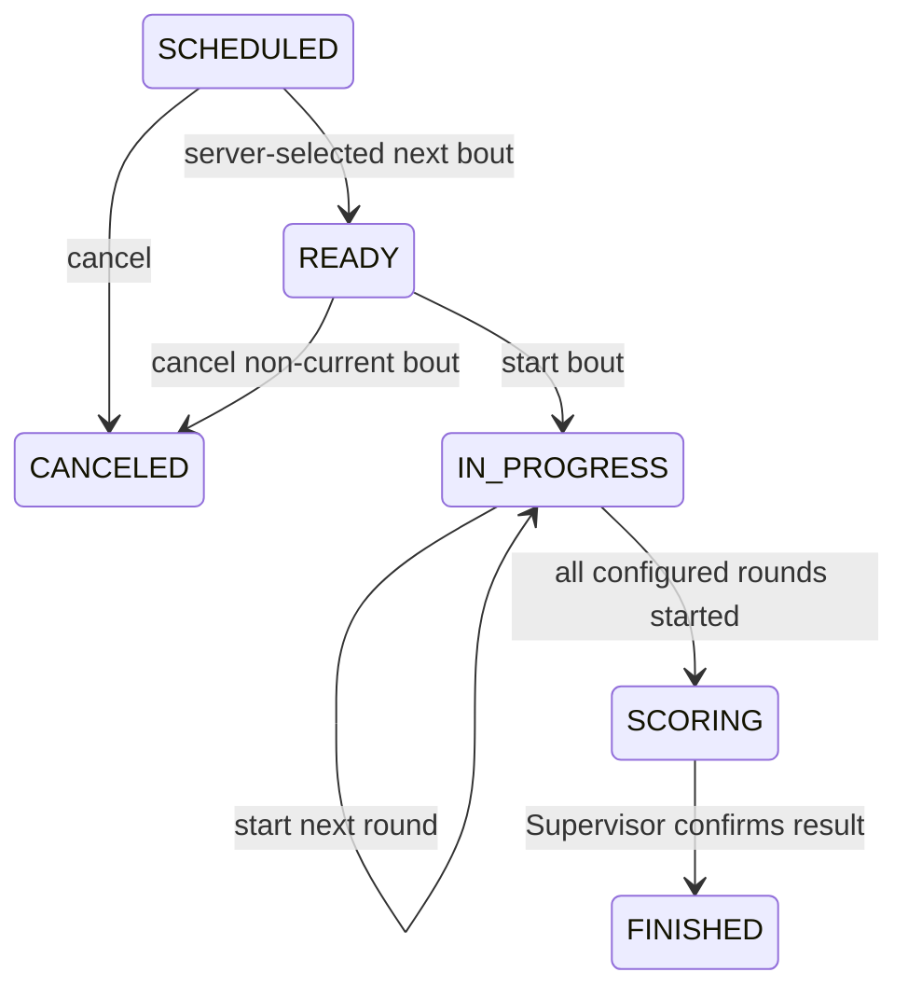

# Bout State Transition Policy

Last updated: 2026-07-16

This document defines the Ring Manager lifecycle contract for the current MVP.
It uses the existing `BoutStatus` values and endpoints. It does not introduce a
new state-change API.

## Statuses

| Status | Meaning | Ring Manager write access |
| --- | --- | --- |
| `SCHEDULED` | Official bout is scheduled but not prepared | Cancel only; preparation is server-selected through the next-bout command |
| `READY` | Bout is prepared for the assigned ring | Start the current bout or cancel when it is not the ring's current bout |
| `IN_PROGRESS` | Bout is active and rounds may be started | Start the next round or send to scoring after the configured rounds |
| `SCORING` | Bout is waiting for Supervisor result confirmation | Read only |
| `FINISHED` | Supervisor confirmed the result and closed the bout | Read only |
| `CANCELED` | Bout was canceled before it started | Read only |

## Transition Graph

The Ring Manager cannot select `FINISHED`. Normal completion is owned by the
Supervisor result-confirmation workflow. Backward transitions, arbitrary
status jumps, and changes from `FINISHED` or `CANCELED` are rejected.

## Server Rules

All mutating Ring Manager methods run in the existing transaction and locking
flow:

1. Resolve the authenticated Ring Manager and active ring assignment.
2. Lock the bout, and lock the ring when ring context is required.
3. Validate the current state and requested operation in the bout domain.
4. Persist only after validation succeeds.
5. Publish one bout event after the transaction succeeds.

`GET /api/staff/assignments/rings?tournamentId=` returns the assigned ring's
`currentBoutId`. The assigned bout collection is still the source of detailed
bout state. The client must not use a public tournament bout list as the
permission source.

### Starting a bout

- Only `READY` bouts can be started through `/bouts/{boutId}/start`.
- A ring cannot have a different current bout.
- Repeating a start request for the same current `IN_PROGRESS` bout returns
  the existing state without a second event.

### Starting rounds

- The bout must be `IN_PROGRESS` and assigned to the current ring.
- The first round is `1`; later rounds must be exactly `currentRound + 1`.
- A round cannot exceed `totalRounds` when that value is configured.
- Repeating the current round request is idempotent.
- Skipped, previous, out-of-range, finished, canceled, and scoring rounds are
  rejected.

### Entering scoring

- The bout must be `IN_PROGRESS` and have started at least one round.
- When `totalRounds` is configured, the current round must reach that value.
- The transition is exposed as a command, not an arbitrary status selector.
- The resulting `SCORING` state waits for Supervisor result confirmation.

### Preparing the next bout

- The ring must have no active bout, or its current bout must be `FINISHED`.
- Another `IN_PROGRESS` or `SCORING` bout on the ring blocks the operation.
- The server chooses the next official candidate by ascending
  `scheduledOrder`.
- Finished and canceled candidates are skipped.
- The client sends only the ring ID; it cannot choose a bout ID.
- With no candidate, the service returns `NEXT_BOUT_NOT_FOUND` as a conflict.

### Canceling

Canceling is provisional venue policy. The current implementation allows
`SCHEDULED` and non-current `READY` bouts to be canceled. A current prepared
bout cannot be canceled because that would leave the ring's current-bout
pointer ambiguous. Canceled bouts are read only.

## Error Contract

| Code | Meaning | HTTP |
| --- | --- | ---: |
| `INVALID_BOUT_TRANSITION` | Requested state or operation is not allowed | 409 |
| `BOUT_RESULT_REQUIRED` | Ring Manager attempted to finish a bout | 409 |
| `BOUT_ALREADY_IN_PROGRESS` | Another bout is active on the ring | 409 |
| `CURRENT_BOUT_NOT_FINISHED` | Next bout requested before current completion | 409 |
| `NEXT_BOUT_NOT_FOUND` | No server-selected next official bout exists | 409 |
| `ROUND_SEQUENCE_INVALID` | Round was skipped or moved backward | 409 |
| `ROUND_OUT_OF_RANGE` | Round exceeds configured range | 400 |
| `INVALID_BOUT_STATE` | Bout is completed, canceled, or awaiting Supervisor result | 409 |
| `CONCURRENT_MODIFICATION` | Optimistic version conflict | 409 |

The frontend maps these codes to venue-oriented messages and never renders the
raw server code as the user-facing explanation.

## Realtime and UI Contract

The `/ring-manager` route uses assigned-ring data, one selected-ring SSE
stream, and REST refetches. Relevant events are `BOUT_STARTED`,
`BOUT_STATUS_CHANGED`, `ROUND_STARTED`, `NEXT_BOUT_READY`, and
`RESULT_CONFIRMED`.

The screen:

- selects an assigned ring instead of accepting a numeric ring ID;
- identifies the server-provided current bout and warns when another bout is
  selected;
- renders only commands valid for the selected state;
- requires confirmation for start, cancel, scoring, and next-bout operations;
- keeps the current data while SSE reconnects;
- coalesces event refreshes and recalculates commands after REST state arrives;
- disables duplicate writes while a command is in flight;
- treats `SCORING`, `FINISHED`, and `CANCELED` as read-only where appropriate.

## Provisional Decisions

Venue officials must confirm cancellation semantics, whether an early scoring
transition is ever valid for exceptional bouts, and whether an event bout uses
the same next-bout ordering. Until then, no fixed boxing rule such as a
hard-coded judge count or round count is introduced.
