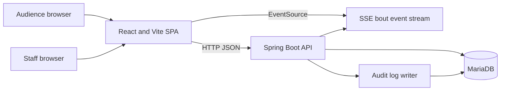
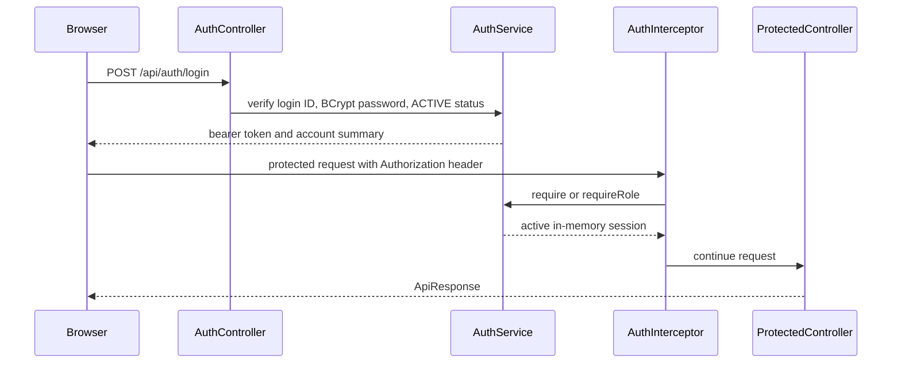
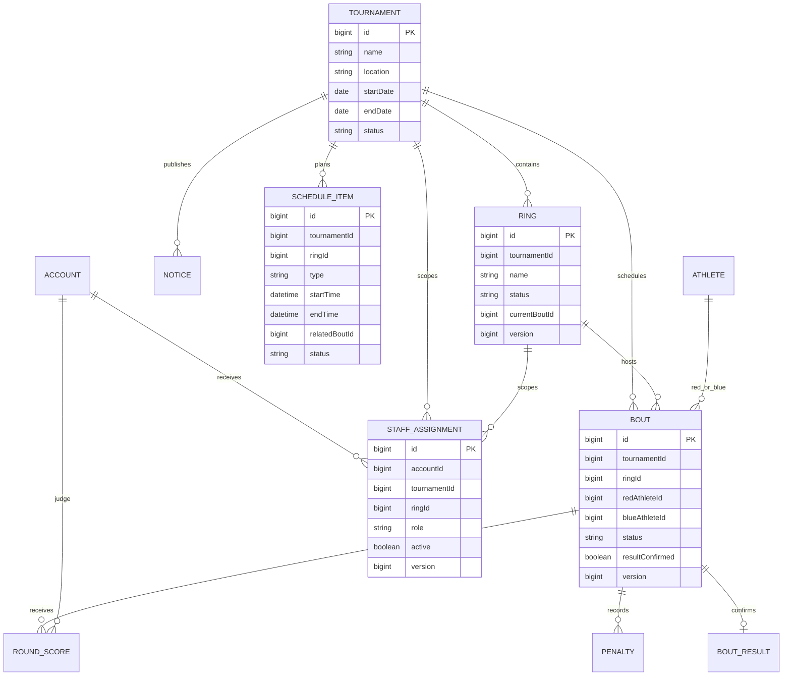
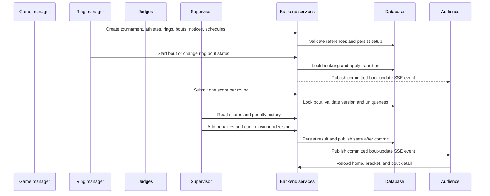

# Boxing Bracket Service Design

Last updated: 2026-07-17

## 1. Purpose

This document describes the architecture and runtime behavior of the current MVP. It is the implementation-oriented companion to [Product requirements](requirements.md) and [Sprint 1 scope](sprint-1.md).

The service replaces paper-based tournament operations with a shared workflow for:

- Public audience status, notices, schedules, brackets, and confirmed results.
- Judge round-score submission.
- Supervisor penalty review and result confirmation.
- Ring-manager bout control.
- Game-manager and service-manager administration.

The design favors explicit tournament IDs, small role-specific desks, server-side validation, and conflict responses that are easy to understand at a venue.

## 2. Current Scope

Implemented MVP capabilities:

- Spring Boot MVC backend with JPA repositories and MariaDB runtime configuration.
- React/Vite single-page frontend with public, judge, supervisor, ring-manager, operations, audit, and admin routes.
- In-memory bearer sessions with a 12-hour lifetime and BCrypt password verification.
- Tournament, ring, athlete, bout, notice, schedule, account, scoring, operation-status, and audit-log modules.
- CSV and Excel bout import with a matching CSV template download.
- Audience and operator ring-filtered SSE bout-update events, transaction-safe dispatch, reconnect handling, and duplicate event protection.
- Optimistic version checks, workflow row locks, idempotent retries, unique constraints, and HTTP 409 conflict responses.

Known MVP boundaries:

- Judge, supervisor, and ring-manager ring assignments are enforced server-side. The assignment unit and API details are in [Staff ring assignment](staff-assignment.md).
- Assigned Judge, Supervisor, and Ring Manager screens subscribe to one selected-ring SSE stream and refetch API state after relevant events.
- Ring Manager state transitions use the existing lifecycle endpoints and the [bout state transition policy](bout-state-transition-policy.md); the server chooses the next official bout and the screen exposes state-specific commands only.
- Judge score submission enforces non-negative whole-number input, started-bout/current-round checks, configured round bounds, and idempotent retry behavior. The provisional policy is in [Judge scoring policy](scoring-policy.md).
- Supervisor result confirmation uses the active assigned-ring scope, authenticated session actor, submitted-score readiness, bout lifecycle, decision, and penalty validation. The contract is in [Supervisor result confirmation policy](result-confirmation-policy.md).
- Sessions are process-local. A shared session store is required for multiple backend instances.
- Schedule mutations do not publish a dedicated schedule SSE event. Audience clients see schedule changes on a full reload.
- Audience tournament discovery is not implemented. The frontend currently accepts a positive `tournamentId` query parameter.
- Server log viewing, advanced statistics, offline support, and Game Manager tournament ownership rules remain deferred.

## 3. System Context



The frontend and backend can be deployed separately. During local development, Vite proxies `/api` to `http://localhost:8080`; production deployment should provide an equivalent reverse-proxy or configure `VITE_API_BASE_URL`. Product and UX decisions are recorded in [Product decisions](product-decisions.md).

## 4. Backend Architecture

The backend is organized by business capability rather than by technical layer alone.

```text
controller -> service -> repository -> entity
     |            |
     +--> DTO     +--> domain validation and workflow rules
```

Each module normally contains:

- `controller`: HTTP mapping and `ApiResponse` wrapping.
- `service`: transaction boundary, input validation, aggregate orchestration, and response mapping.
- `repository`: Spring Data JPA queries and workflow locks where needed.
- `domain`: entity state, invariants, and state transitions.
- `dto`: request and response contracts.

Core modules:

| Module | Responsibility |
| --- | --- |
| `auth` | Login, logout, session lookup, role checks, interceptor integration |
| `tournament` | Tournament metadata and admin CRUD |
| `athlete` | Reusable athlete master data and admin CRUD |
| `ring` | Tournament ring status, current bout context, and admin CRUD |
| `bout` | Official bout list/search/detail, bout lifecycle, admin CRUD/import |
| `scoring` | Judge scores, supervisor penalties, and confirmed results |
| `schedule` | Public and admin tournament schedule items |
| `notice` | Public active notices and admin publishing lifecycle |
| `home` | Aggregated audience response |
| `operation` | Tournament-wide operational monitoring |
| `event` | Tournament/ring-filtered SSE bout updates |
| `audit` | Mutation resolution, snapshots, masking, persistence, and search |
| `assignment` | Staff ring assignments, assigned-ring lists, and staff scope enforcement |

Controllers do not access repositories directly. Cross-module references use IDs and are validated by the owning service. The current model intentionally avoids JPA entity associations for tournament, ring, athlete, bout, account, and schedule references.

## 5. Frontend Architecture

The detailed frontend screen, state, API, SSE, component, responsive,
accessibility, test, and deployment map is maintained in the
[frontend wide-frame architecture guide](frontend-wide-frame.md).

`front/src/App.jsx` owns route composition and reads `tournamentId` from the URL. `AppHeader` preserves the selected tournament ID while navigating between desks.

```text
App
|-- AppHeader and tournament query state
|-- AudienceHome -> useAudienceData + useBoutEventStream
|-- BracketPage
|-- JudgeAssignedPage
|-- SupervisorAssignedPage
|-- RingManagerAssignedPage
|-- OperationsPage
|-- AuditLogPage
|-- Admin*Page routes
`-- shared components, API clients, hooks, and styles
```

The MVP currently gives each authenticated desk its own login/session validation and limits the UI by role before making protected API calls. The target UX consolidates these forms into one `/staff/login` entry point, then routes the authenticated account to its role-specific workspace and navigation. API clients share `requestApi`, which adds JSON headers, optional bearer authorization, parses the common response envelope, and turns server failures into JavaScript errors.

The public home aggregates notices, ring status, confirmed results, and schedules from `/api/home`. It opens bout details through the public bout detail API. SSE reconnects trigger a fresh audience data load, so the stream is an invalidation signal rather than the source of truth.

Assigned staff screens reuse the same stream with `tournamentId` and the selected
`ringId`. They keep one `EventSource` per screen, close it when the ring changes
or the screen unmounts, and refetch assigned bouts and selected detail data after
relevant events. SSE payloads never replace REST responses; an unavailable stream
leaves write actions usable and preserves the last API-confirmed state.

## 6. Authentication and Authorization

Authentication is enabled by the local profile and disabled by the test profile.



Current route policy:

| Path prefix | Required role |
| --- | --- |
| `/api/auth/logout`, `/api/auth/me` | Any authenticated session |
| `/api/admin/accounts` | `SERVICE_MANAGER` |
| `/api/admin/**` | `GAME_MANAGER` or `SERVICE_MANAGER` |
| `/api/judge/**` | `JUDGE` |
| `/api/supervisor/**` | `SUPERVISOR` |
| `/api/ring-manager/**` | `RING_MANAGER` |
| `/api/staff/**` | `JUDGE`, `SUPERVISOR`, or `RING_MANAGER` |
| Public audience, bracket, notice, schedule, health, and event routes | No role rule |

The interceptor applies to `/api/**`, excluding health and login. A request with no matching policy is allowed to continue, which is how public routes remain unauthenticated.

## 7. Domain Model

All entities inherit `createdAt` and `updatedAt` from `BaseTimeEntity`. Most cross-entity relationships are stored as scalar IDs.



Current implementation status values are authoritative for the MVP:

| Aggregate | Values |
| --- | --- |
| Tournament | `READY`, `IN_PROGRESS`, `FINISHED` |
| Ring | `READY`, `IN_PROGRESS`, `CLOSED` |
| Bout | `SCHEDULED`, `READY`, `IN_PROGRESS`, `SCORING`, `FINISHED`, `CANCELED` |
| Schedule item | `SCHEDULED`, `IN_PROGRESS`, `COMPLETED` |
| Round score | `DRAFT`, `SUBMITTED` |

The product requirements use some different target vocabulary, such as `PREPARING` or `COMPLETED`. That vocabulary is retained as product direction; API clients and database values must use the current implementation values until a deliberate migration is planned.

## 8. Core Workflow



Workflow rules:

1. Equivalent repeated requests return the existing state where the operation is idempotent.
2. A different payload against an already submitted or completed state returns HTTP 409.
3. Bout, ring, score, and result aggregates use optimistic versions.
4. Mutating bout and ring operations use transaction-scoped pessimistic locks.
5. Database uniqueness protects one score per judge/bout/round and one result per bout.
6. SSE dispatch is registered after transaction commit, so rolled-back state is not broadcast.
7. Judge score validation is performed before persistence; failed validation does not publish a score event.
8. Supervisor result and penalty validation is performed before persistence; failed mutations do not publish scoring events.
9. Ring Manager lifecycle validation is performed in the bout domain before persistence; failed transitions do not publish bout events.

## 9. API Contract

Successful controller responses use:

```json
{
  "success": true,
  "data": {},
  "message": "OK"
}
```

Failures use the same envelope with `success: false`, `data: null`, and a stable message. The global handler maps validation to `400`, missing authentication to `401`, role failures to `403`, missing resources to `404`, workflow and optimistic conflicts to `409`, and unexpected failures to `500`.

API groups:

| Group | Main endpoints | Access |
| --- | --- | --- |
| Auth | `/api/auth/login`, `/logout`, `/me` | Login public; logout/me authenticated |
| Audience home | `/api/home`, `/api/bouts`, `/api/bouts/{boutId}`, `/api/events/stream` | Public |
| Live events | `/api/events/stream?tournamentId=&ringId=` | Public |
| Judge | `/api/judge/bouts/{boutId}/scores`, score submit endpoint | `JUDGE` |
| Supervisor | scores, penalties, result endpoints | `SUPERVISOR` |
| Ring manager | ring bout list and lifecycle commands | `RING_MANAGER` |
| Staff scope | `/api/staff/assignments/rings`, `/api/staff/assignments/rings/{ringId}/bouts` | `JUDGE`, `SUPERVISOR`, `RING_MANAGER` |
| Operations | `/api/admin/operations/status` | `GAME_MANAGER`, `SERVICE_MANAGER` |
| Audit | `/api/admin/audit-logs` | `GAME_MANAGER`, `SERVICE_MANAGER` |
| Administration | tournaments, rings, athletes, bouts, notices, schedules | `GAME_MANAGER`, `SERVICE_MANAGER` |
| Account administration | `/api/admin/accounts` | `SERVICE_MANAGER` |
| Staff assignment administration | `/api/admin/assignments` | `GAME_MANAGER`, `SERVICE_MANAGER` |

The detailed endpoint list remains in [Sprint 1 scope](sprint-1.md). Frontend-specific route and API usage remains in [frontend README](../front/README.md).

## 10. Persistence and Deployment

The local profile expects MariaDB at `boxing_bracket`, runs Flyway from
`back/src/main/resources/db/migration/`, and uses `ddl-auto: validate`. Flyway
is the schema owner; Hibernate validates the resulting schema and never creates
or alters tables at application startup. The policy and operator procedures are
in [Database migration policy](database-migration.md).

The current baseline is `V1__create_initial_schema.sql`. It includes all
currently mapped tables, optimistic-lock columns, workflow uniqueness
constraints, schedule and staff-assignment indexes, and audit-log indexes.
Entity references are scalar IDs, so this baseline intentionally does not add
foreign keys that the current model does not declare.

The repository contains no evidence of a deployed shared database. New
installations therefore start from V1. An existing database must be inspected,
backed up, and explicitly baselined only after its schema is proven equivalent;
`baseline-on-migrate` is disabled so an unknown schema cannot start silently.

The test profile uses H2 in MySQL compatibility mode, applies the same Flyway
V1 migration, and then validates the JPA mapping. A migration integration test
checks the history table, idempotent startup, tables, version columns, and
operational unique constraints.

Operational prerequisites:

- Java 11, Maven 3.9.x, Node.js 24.x, and npm.
- No Maven Wrapper is tracked; local and CI backend verification use the available Maven 3.9.x command.
- MariaDB database and account setup before local-profile startup; Flyway applies pending migrations automatically.
- Active role accounts and tournament reference data for authenticated end-to-end testing.
- A shared session store and external event delivery strategy before running multiple backend instances.
- Source verification runs through separate [Backend CI](../.github/workflows/backend-ci.yml) and [Frontend CI](../.github/workflows/frontend-ci.yml) workflows. CI uses Temurin Java 11, Node.js 24, Maven/npm dependency caches, read-only repository permissions, and no deployment secrets.

## 11. Audit and Observability

`AuditLogAspect` resolves mutation paths, captures before/after snapshots, masks sensitive fields, and persists audit records through a separate writer transaction. The audit query supports tournament, actor, role, action, target, ring, bout, success, time range, and pagination filters.

Audit records are intentionally not foreign-key cascaded. This preserves history when an account, notice, schedule, or bout is deleted. Audit persistence failures are logged without rolling back the business operation.

Server log viewing is intentionally deferred. The current operational UI reads structured tournament status and administrator audit data instead.

## 12. Verification

The latest documented verification is:

- Backend: 72 test classes, 382 test cases, zero failures, errors, or skips.
- Frontend: 24 test files, 79 test cases, ESLint passed, and Vite production build passed.
- Test inventory and user-flow coverage: [Testing](testing.md).

The test profile does not seed production accounts or tournament data. Authenticated desks require test fixtures or a running local database with active accounts.

## 13. Deferred Decisions

The following decisions should be made before expanding beyond the MVP:

- Assignment model: ring-level assignments are implemented; manager ownership per tournament remains to be decided.
- Session storage: Redis or another shared store, token revocation, and operational session monitoring.
- Public tournament discovery: directory endpoint, default tournament selection, and closed/completed tournament visibility.
- Event model: whether schedule, notice, and ring-status changes should use SSE in addition to bout updates.
- Result policy: allowed decision types, confirmed-result correction workflow, and approval requirements; current implementation is documented in [Supervisor result confirmation policy](result-confirmation-policy.md).
- Ring Manager lifecycle: current status transitions, round sequencing, next-bout ordering, and cancellation semantics are documented in [Bout state transition policy](bout-state-transition-policy.md); cancellation and exceptional-bout behavior remain venue decisions.
- Boxing scoring policy: maximum score, ten-point rule, tied-round handling, deduction interaction, and exceptional-bout timing require venue confirmation; see [Judge scoring policy](scoring-policy.md).
- Data ownership: whether athletes remain global master data or become tournament-scoped records.
- Production migration operations: backup, approval, rollback/forward-fix policy, and schema ownership for shared databases.
